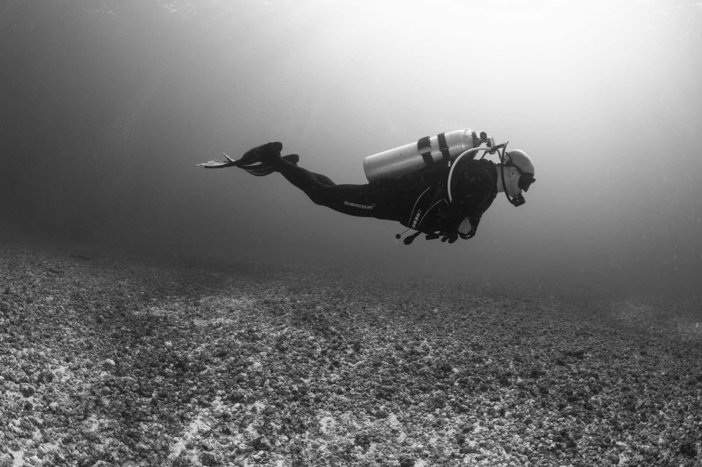

### Hi there 👋
***

I am a **Senior Performance Engineer** @mongodb working remotely from Barcelona.

One thing that everybody should know about me is that I Love technology and learning. In the last few years I passed the following certifications and courses:

- 🏴‍☠️ OSCP from _Offensive Security_
- 🏴‍☠️ Ethical Hacker from _Udacity_
- 🧑🏻‍💻 Cloud Devops Engineer from _Udacity_
- ☁️ AWS Solutions Architect Professional from _AWS_
- 📈 Tableau Desktop Qualified Associate from _Tableu_
- 🤖 Artificial Intelligence from _Udacity_

and many many more. If you want to know more about me, or to get my contact details, please visit [my website](https://miguelangelnieto.net).

A part from technology I also scuba dive in my free time.

See you on the internet, or under the water!